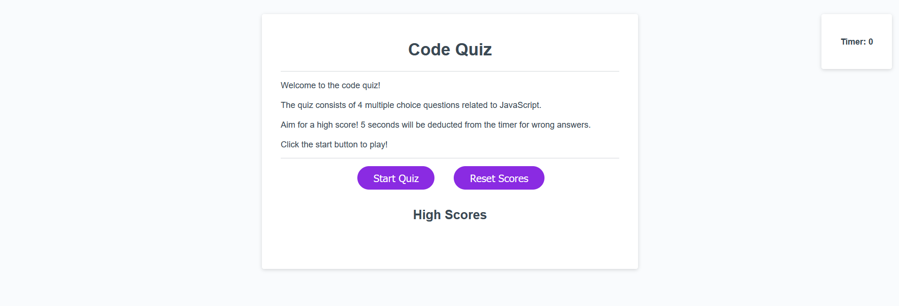
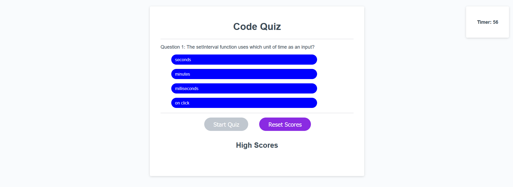

# <code-quiz>

## Description

This project aimed to create a a code quiz using JavaScript webapis. The project presented the user with a code quiz with a running timer upon clicking the start quiz button. Questions could be answered by clicking directly on the answers, which would then show if the user was correct or incorrect. If the user was incorrect time would be decucted from the timer. Answering questions would immediately prompt the next question. When the quiz was completed the user would be prompted for their name which would be written to the leaderboard and saved to local storage. Local storage ensured that the leaderboard would remain populated through page reloads until the user pressed the reset scores button.

This project highlighted the use of JavaScript web api to dynamically alter the displayed html as users interact with the site. The project also used event listeners to allow interaction with particular page elements and dynamically respond. The use of local storage was also highlighted to have the page save and store results so that it would survive page reloads.

## Usage

A deployed version of the project can be found at https://mgberrysd.github.io/code-quiz/

When loaded the page should appear as:

When the start quiz button is pressed the page should display the the first question and clickable answers:

## Credits

The JS and html for the code quiz was created by Michael Berry. The CSS was partially taken and modified from the CSS provided for the previous password generator project.